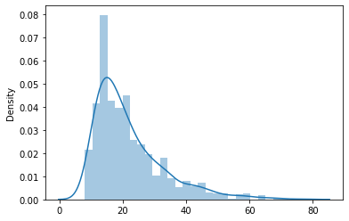
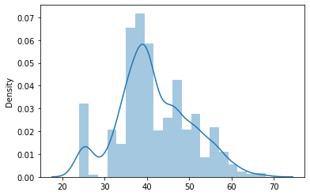

# Search based optimization

## Solving CartPole-v0 OpenAI

In this assignment you will use search based optimization algorithms in order to solve the OpenAI gym cartpole-V0 environment.
A pole is attached by an un-actuated joint to a cart, which moves along a frictionless track. The system is controlled by applying a force of +1 or -1 to the cart. The pendulum starts upright, and the goal is to prevent it from falling over. A reward of +1 is provided for every timestep that the
pole remains upright. The episode ends when the pole is more than 15 degrees from vertical, or the cart moves more than 2.4 units from the center.

## Random action based control

Run the cartpole for 1000 episodes. Control the cartpole by choosing random actions.

- For each episode register the number of successful timesteps.
- Plot a histogram of the number of successful timesteps. You can use the Seaborn distplot function for visualizing this histogram.
    > 
- What is the average number of successful timesteps you achieve by taking random actions?
    > It varies between 20 and 30 typically

## Angle based action control

Use the information about the angle of the pole to decide on the best action to take. If the pole is falling to the right, push the cart to the right. If the pole is falling to the left, push the cart to the left.
Again, run the cartpole for 1000 episodes.
- For each episode register the number of successful timesteps.
- Plot a histogram of the number of successful timesteps. You can use the Seaborn distplot function for visualizing this histogram.
    > 
- What is the average number of successful timesteps you achieved over these 1000 episodes?
    > It varies around 40

## Random search based control

First define a vector of weights. Each of the weights corresponds to a one cartpole observation variable. The action will be based on the outcome of a linear combination of weights and observations.

Choose the action based on the following rule:

- Run 1000 iteration. For each iteration set the weights to a random value (in a realistic range) and evaluate these weights by running 20 episodes. The achieved reward for one iteration (and thus a weight vector) is the average reward over the 20 episodes. Store the history of iterations (average reward and the weight vector).
- Which weight vector yields the highest average reward?
- Now test these best weights over 1000 episodes. What is the average reward you have achieved?
- Can you read from the weights which observation variables are important and which ones are not important in deciding which action to take?
- Make a 3D graph (scatterplot) showing which weight vectors achieve an average reward larger than 100 and which ones do not. To plot this graph you will put the 3 most important weights on the x,y,z axis. A red color indicates an average reward higher or equal than 100, black indicates an average reward lower than 100.

## Hill climbing

Implement the hill climbing algorithm to find a good weight vector. You start with a random weight vector. Each iteration you slightly change the weight vector by adding some noise (can be taken from a normal distribution with mean 0 and standard deviation sigma. If the new weight
vector results in a higher reward (for example over 20 episodes) then you can keep the new weight vector. Otherwise you stick to the old one.
- Run 1000 iteration. For each iteration set the weights to a random value (in a realistic range) and evaluate these weights by running 20 episodes. The achieved reward for one iteration (and thus a weight vector) is the average reward over the 20 episodes. Store the history of iterations (average reward and the weight vector).
- Which weight vector yields the highest average reward?
- Now test these best weights over 1000 episodes. What is the average reward you have achieved? Plot the histogram of the rewards.

## Simulated annealing

Now change the hill climbing algorithm to simulated annealing. Also here you will run 1000 iterations with 20 episodes per iteration.
- Set a starting temperature and a cooling rate.
- Randomly change the weights and evaluate the current reward Rt.
- If the current reward Rt is higher than the previous reward Rt-1 keep the new weights (hill climbing). where .
- Gradually lower the temperature.
- Run 1000 iteration. For each iteration set the weights to a random value (in a realistic range) and evaluate these weights by running 20 episodes. The achieved reward for one iteration (and thus a weight vector) is the average reward over the 20 episodes. Store the history of iterations (average reward and the weight vector).
- Which weight vector yields the highest average reward?
- Now test these best weights over 1000 episodes. What is the average reward you have achieved? Plot the histogram of the rewards.

## Adaptive noise scaling

Modify the simulated annealing algorithm in the following way:
Reduce the standard deviation of the distribution we sample the noise from when the new reward is higher than the previous reward. Otherwise increase the standard deviation. For example you can half or double the standard deviation. It’s up to you to find a good value for the scaling factor.
- Run 1000 iteration. For each iteration set the weights to a random value (in a realistic range) and evaluate these weights by running 20 episodes. The achieved reward for one iteration (and thus a weight vector) is the average reward over the 20 episodes. Store the history of iterations (average reward and the weight vector).
- Which weight vector yields the highest average reward?
- Now test these best weights over 1000 episodes. What is the average reward you have achieved? Plot the histogram of the rewards.

## Extensions & conclusions

How do these different search algorithms compare to or differ from each other in terms of reward and computational efficiency?
- Check if you can solve the cartpole-V1 environment. This environment has a maximum number of episodes steps of 500 where the cartpole-V0 is limited to 200 episode steps.
- Does it make sense to increase the number of observation variables by deriving new observations from the existing ones? Think of it as feature expansion in machine learning.
- Consider the MountainCar-v0 environment. Argument whether or not it is possible 